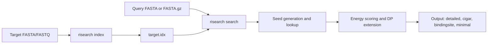

# RIsearch (Rust)


RIsearch predicts RNA-RNA interactions using a suffix-array seed search and
energy-based extension model.

This repository is the Rust port of the legacy RIsearch2 C implementation.
The vendored C code lives in
[`legacy_c/RIsearch2`](legacy_c/RIsearch2/README) (also on GitHub:
<https://github.com/saiden89/risearch/tree/main/legacy_c/RIsearch2>), and this
Rust CLI/library tracks compatibility while modernizing performance and tooling.

## Quick Nav

- [RIsearch (Rust)](#risearch-rust)
  - [Quick Nav](#quick-nav)
  - [Why RIsearch](#why-risearch)
  - [Workflow](#workflow)
  - [Status](#status)
  - [Installation](#installation)
  - [Quickstart](#quickstart)
  - [Core Commands](#core-commands)
  - [Common Recipes](#common-recipes)
  - [Compatibility and Migration](#compatibility-and-migration)
  - [Performance and Parallelism](#performance-and-parallelism)
    - [OpenMP Profile for Faster Index Builds](#openmp-profile-for-faster-index-builds)
  - [Troubleshooting and FAQ](#troubleshooting-and-faq)
    - [OpenMP build fails with `omp.h file not found`](#openmp-build-fails-with-omph-file-not-found)
    - [Why are thread counts different between `index` and `search`?](#why-are-thread-counts-different-between-index-and-search)
    - [I still use `-s`, `-m`, or `-p` and see warnings](#i-still-use--s--m-or--p-and-see-warnings)
    - [Search returned no hits](#search-returned-no-hits)
  - [Developer Validation](#developer-validation)
  - [Further Documentation](#further-documentation)
  - [License](#license)

## Why RIsearch

- Fast suffix-array indexing and seed search for RNA-RNA interaction discovery.
- Energy-based extension model with practical filters for production pipelines.
- Modern CLI with streaming output, multiple formats, and gzip/zstd compression.
- Legacy compatibility path for teams migrating from `risearch2` flags/workflows.

## Workflow



## Status

`risearch` is currently **alpha** (`3.0.0-alpha.1`). Core `index`/`search`
workflows are active and tested, while some legacy compatibility flags remain
deprecated and scheduled for removal.

## Installation

Need Cargo? Install Rust (includes `cargo`) via https://rustup.rs/

Build:

```bash
cargo build --release
```

Install locally:

```bash
cargo install --path .
```

Sanity check:

```bash
risearch --help
```

If you have not installed the binary yet, use `cargo run --release -- ...` in
the examples below.

## Quickstart

```bash
# Build index from target sequences
risearch index target.fa target.idx

# Run interaction search
risearch search \
  -q query.fa \
  -t target.idx \
  --seed-length 6 \
  -l 20 \
  -e -20 \
  --format detailed \
  -o results.tsv

# Optional: compressed output
risearch search -q query.fa -t target.idx --format minimal -o results.tsv.gz
```

## Core Commands

```text
risearch index <INPUT> <OUTPUT>
risearch search -q <QUERY_FASTA(.gz)> -t <TARGET_INDEX> [OPTIONS]
```

- `index`: build an index from target FASTA/FASTQ input.
- `search`: run seed-and-extend search for one or more query sequences.

Global flags:

- `-j, --jobs <N>`: worker threads (defaults to detected CPU parallelism).
- `-v/-vv/-vvv`: increase log verbosity.

Run `risearch --help`, `risearch index --help`, and `risearch search --help`
for the full and current option surface.

## Common Recipes

Use modern long-form flags in new scripts and pipelines.

Select seed interval and length:

```bash
risearch search \
  -q query.fa \
  -t target.idx \
  --seed-start 1 \
  --seed-end 20 \
  --seed-length 7
```

Allow mismatches with explicit constraints:

```bash
risearch search \
  -q query.fa \
  -t target.idx \
  --mismatch-max 1 \
  --mismatch-prefix 3 \
  --mismatch-suffix 3
```

Enable wobble seed pairing (strict is default):

```bash
risearch search -q query.fa -t target.idx --seed-pairing allow_wobble
```

Output formats:

- `--format detailed` (default)
- `--format cigar`
- `--format bindingsite`
- `--format minimal`

Compression and multifile output:

```bash
risearch search \
  -q queries.fa \
  -t target.idx \
  --format minimal \
  --compress zstd \
  --compress-level 6 \
  --multifile \
  -o out_dir
```

Tuning and filtering:

- `-z, --matrix <t04|t99>` energy model (`t04` default).
- `-d, --penalty <kcal/mol>` per-nucleotide penalty.
- `-l, --extension <L>` max extension around seed.
- `-e, --energy <dG>` filter by deltaG threshold.
- `--seed-energy <threshold>` seed-level energy filter.
- `--no-max-prune` disable maximality pruning.

## Compatibility and Migration

Legacy short-hands are still accepted but deprecated. Prefer the replacements
below in new usage.

Legacy C reference implementation:

- Local copy in this repo: [RIsearch2 README](legacy_c/RIsearch2/README)
- GitHub path: [legacy_c/RIsearch2](https://github.com/saiden89/risearch/tree/main/legacy_c/RIsearch2)

| Legacy usage | Modern usage | Notes |
| --- | --- | --- |
| `-i`, `--index` | `-t`, `--target` | Legacy target flags are deprecated aliases. |
| `-p`, `-p2`, `-p3`, `-p4` | `--format detailed/cigar/bindingsite/minimal` | `--format` takes precedence if both are present. |
| `-m c[:ps[:pe]]` | `--mismatch-max C --mismatch-prefix PS --mismatch-suffix PE` | Do not combine legacy and modern mismatch forms. |
| `-s l`, `-s m:n`, `-s m:n/l` | `--seed-length L`, `--seed-start M --seed-end N`, plus optional `--seed-length L` | Do not combine legacy `-s` with `--seed-*` overrides. |
| `-U`, `--no-guseed` | Default strict mode, or explicit `--seed-pairing strict` | Use `--seed-pairing allow_wobble` to enable wobble. |

## Performance and Parallelism

- Use `--jobs` to control CPU utilization.
- For large runs, prefer file output (`-o file`) and compression (`--compress`)
  to reduce I/O overhead and disk footprint.

### OpenMP Profile for Faster Index Builds

To enable OpenMP-backed suffix-array construction during `index`, build with
the `openmp` feature:

```bash
cargo build --release --features openmp
```

Or install with OpenMP enabled:

```bash
cargo install --path . --features openmp
```

Run indexing with explicit thread settings:

```bash
OMP_NUM_THREADS=16 risearch -j 16 index target.fa target.idx
```

Caveats:

- OpenMP currently changes the `index` suffix-array build path (libsais).
  `search` is still multithreaded, but through Rayon (`--jobs`) rather than
  OpenMP.
- `--jobs` controls Rayon threads; OpenMP thread count is controlled separately
  by the OpenMP runtime (for example `OMP_NUM_THREADS`).
- On macOS, OpenMP builds can fail with `omp.h file not found` unless `libomp`
  is installed and visible to the compiler/linker.
- If OpenMP toolchain support is unavailable, build without `--features openmp`
  and use the default single-threaded libsais path.

## Troubleshooting and FAQ

### OpenMP build fails with `omp.h file not found`

OpenMP headers/runtime are missing from your toolchain. Install OpenMP for your
platform (for example, `libomp` on macOS) and retry with
`cargo build --release --features openmp`.

### Why are thread counts different between `index` and `search`?

`search` uses Rayon threads via `--jobs`. With `--features openmp`, part of
`index` also uses OpenMP-controlled threads (for example via
`OMP_NUM_THREADS`). Tune both if needed.

### I still use `-s`, `-m`, or `-p` and see warnings

Those flags are accepted for migration but deprecated. Use
`--seed-start/--seed-end/--seed-length`, `--mismatch-*`, and `--format`.

### Search returned no hits

Start by relaxing constraints: increase `--energy` threshold (less negative),
reduce `--seed-length`, increase extension length (`-l`), and test
`--seed-pairing allow_wobble` if biologically appropriate.

## Developer Validation

Run all tests:

```bash
cargo test
```

Run selected integration suites:

```bash
cargo test --test cli_output_compress
cargo test --test cli_multifile_and_seed_validation
cargo test --test parity_mismatch_regression
```

## Further Documentation

- [Implementation strategies](docs/strategies.md)
- [Legacy C implementation reference](docs/c_implementation.md)
- [SIMD design discussion](docs/SIMD_ARCHITECTURE.md)
- [Exhaustive testing strategy](docs/testing_strategy_exhaustive.md)
- [DP profile precomputation notes](docs/dp_profile_precomputation.md)

## License

- Rust port in this repository: GNU GPL v3 (see [LICENSE](LICENSE)).
- Vendored RIsearch2 C implementation: GPL v3 or later (see
  [legacy_c/RIsearch2/README](legacy_c/RIsearch2/README)).
- Vendored `libdivsufsort` under `legacy_c/RIsearch2/libdivsufsort-2.0.1` has
  its own license text (see
  [legacy_c/RIsearch2/libdivsufsort-2.0.1/COPYING](legacy_c/RIsearch2/libdivsufsort-2.0.1/COPYING)).
