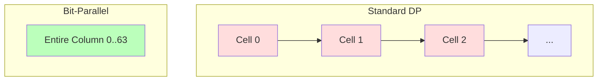

# Bit-Parallel & SIMD Optimization

While Wavefront Alignment (WFA) optimizes by skipping cells, **Bit-Parallelism** optimizes by computing many cells simultaneously using standard CPU integer operations.

## The Core Concept: Myers' Algorithm (1999)

Standard Dynamic Programming calculates the score of cell $(i, j)$ based on its neighbors.
Myers realized that the *difference* in score between adjacent cells is always $-1$, $0$, or $+1$.

Matches/Mismatches can be encoded as bitmasks.
If we align a query of length $M$ against a target, and $M \le 64$ (which matches your `MAX_DP_EXT=30`), we can represent **an entire column of the DP matrix** in a single 64-bit integer (machine word).

### How it works visually

Imagine the DP matrix. Instead of a loop iterating $j=0..30$ for every column $i$:



We compute the entire vertical `Col` vector in a handful of bitwise operations (AND, OR, XOR, ADD).

### The Math (Simplified)

Let $P_v$ be a bitvector where the $k$-th bit is 1 if cell $k$ has a score increment of +1, and $M_v$ be where it is -1.
The transition for the entire column for character $T[j]$ can be computed as:

```rust
// Matches for character T[j] against all Query characters 0..63
let eq = pattern_bitmasks[T[j] as usize]; 

// Magic bitwise logic to propagate scores down the column
let xv = eq | mv;
let xh = (((eq & pv) + pv) ^ pv) | eq;
let ph = mv | (! (xh | pv));
let mh = pv & xh;
// ... (approx 10 ops total)
```

**Result:** You advance one full column in the alignment grid in ~10 CPU cycles, virtually independent of the column height ($M$).

## Expected Speedup for RiSearch

Your case is **perfect** for this:

1. **Short Extension**: `MAX_DP_EXT = 30`.
2. **64-bit limit**: $30 < 64$. You fit in `u64`.

### Comparison

| Metric | Standard DP | Bit-Parallel (Myers) |
| :--- | :--- | :--- |
| **Complexity** | $O(N \times M)$ | $O(N \times \lceil M/64 \rceil)$ |
| **Ops per Column** | $30$ iterations $\times$ branching logic | $\sim 10$ bitwise ops (no branches) |
| **Memory** | Read/Write Matrix (Cache pressure) | Register-only (Zero RAM traffic) |
| **Total Ops** | $\sim 900$ | $\sim 300$ |

**Speedup Factor:** ~30x (theoretical peak), likely **10-15x real-world**.

## Why this beats AVX/SIMD here

**SIMD (Single Instruction Multiple Data)** usually relies on AVX2/AVX-512 registers (256/512 bits).

* **Inter-Sequence SIMD**: Process 8 different DNA sequences at once.
  * *Pros:* Huge throughput.
  * *Cons:* Very hard to implement if sequences end at different times or require different logic (divergence).
* **Intra-Sequence SIMD**: Vectorize the DP diagonals.
  * *Cons:* For length 30, the overhead of loading/unloading vector registers often limits gains compared to simple `u64` operations.

**Bit-Parallel (Myers)** uses standard general-purpose registers (`RAX`, `RBX` etc.), which are:

1. Available on *every* CPU (no AVX requirement).
2. Lower latency than vector units.
3. Zero data structure overhead (no "wavefronts" to manage).

## Implementation Strategy

1. **Precompute**: Create an array of 4 `u64` masks (one for A, C, G, U), where the $k$-th bit is 1 if Query[$k$] equals that base.
2. **Scan**: Iterate through the Target sequence.
3. **Update**: Apply the bitwise formulas to update the `Score` and `CurrentColumn` state.
4. **Extract**: At the end, popcount or extract bits to get the max score.

> [!TIP]
> This is exactly what the `edlib` C++ library does, which is why it is one of the fastest aligners in existence.
