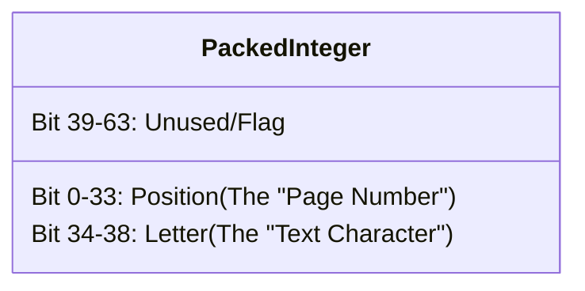

# The "Hybrid Suffix Array" Explained visually

## 1. The Basics: What needs to be stored?

To search DNA thoroughly, we need to search both the **Forward** strand (`AGCT`) and the **Reverse Complement** (`AGCT` -> `AGCT`).

### The Standard Approach (Rust / Modern)

We typically store 4 separate things in Memory (RAM):

1. **Forward Text:** (1 byte/char) -> The actual books.
2. **Reverse Text:** (1 byte/char) -> The actual books (mirrored).
3. **Forward Index:** (8 bytes/char) -> The Table of Contents.
4. **Reverse Index:** (8 bytes/char) -> The Table of Contents.

Total Memory: **18 bytes** per DNA letter.
*Note: We need separate memory for the Reverse Text so the index can point to it.*

## 2. The Legacy C "Trick" (Packing)

The C developer realized: *"I'm already paying 16 bytes for the two Indexes. If I hide the letters inside the Index numbers, I can delete the Text arrays entirely!"*



**The Gain:** They delete **both** the Forward Text and the Reverse Text arrays.

* **Saved:** 2 bytes per DNA letter. (About 6GB RAM for a human genome).
* **Result:** They fit the whole thing in just the space of the Indexes (16 bytes/char).

## 3. The Hidden Cost: Reading is Hard

The problem happens when we just want to read the text (like "Read the next 64 letters").

### Standard Approach (Fast Bandwidth)

Since letters are byte-by-byte (dense), the CPU grabs a **Cache Line** (a 64-byte chunk) and gets **64 letters** instantly.

* **Bandwidth Efficiency:** 100% (Every byte fetched is a letter we need).

```
[ A | C | G | T | A | A | C | G ... ]  <-- One memory fetch gets all of these!
```

### The C Approach (Low Bandwidth)

The letters are hidden inside giant 64-bit (8-byte) integers. To read characters `i, i+1, i+2...`:

1. CPU fetches `SA[i]` (8 bytes). **Useful info: 5 bits (The letter). Garbage: 59 bits (The position).**
2. CPU fetches `SA[i+1]` (8 bytes). (And so on...)

* **Bandwidth Efficiency:** ~10% (Most of the data fetched is the "Page Number" junk).

**Visualizing the Waste:**

```text
[ Letter | <------ GIANT NUMBER (Junk) ------> ]
[ Letter | <------ GIANT NUMBER (Junk) ------> ]
[ Letter | <------ GIANT NUMBER (Junk) ------> ]
```

## Summary & Definitions

| Technical Term | "Book" Analogy | What C Code Does |
| :--- | :--- | :--- |
| **RAM / Memory** | The Bookshelf | Saves shelf space by shredding the original books and writing the words onto the Table of Contents instead. |
| **Bandwidth** | Reading Speed | Slows down reading because you have to heave around heavy "Table of Contents" volumes just to read a single sentence. |
| **Cache Line** | One glance of the eye | Instead of glancing at a page and seeing 64 words (Standard), one glance only shows you 8 words because they are spaced out by giant page numbers. |
| **Suffix Array** | Table of Contents | It's supposed to just tell you *where* words are. Here, it also *contains* the words. |

**Verdict:** The "Hybrid Layout" saves **Storage** (Shelf Space) but hurts **Bandwidth** (Reading Speed).
