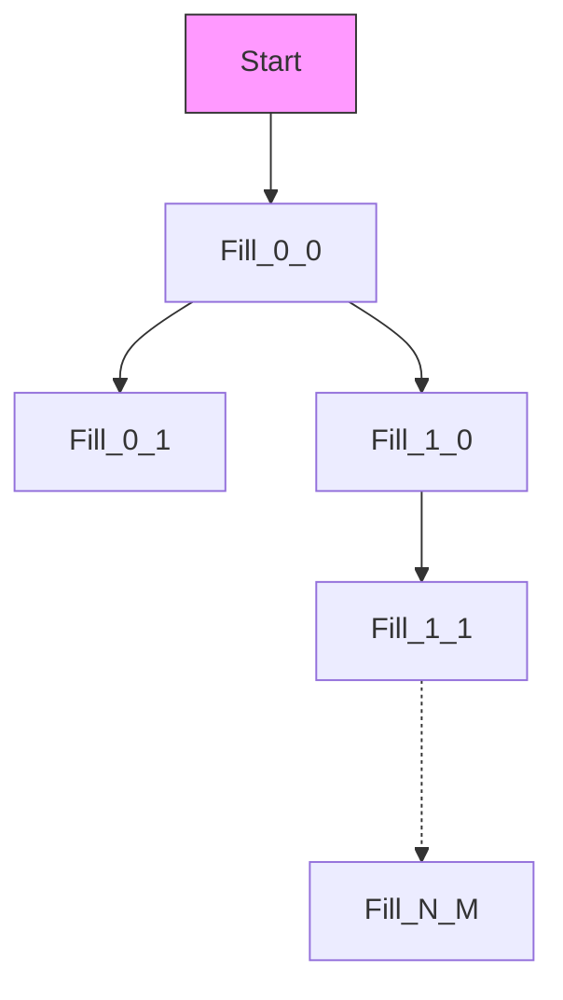
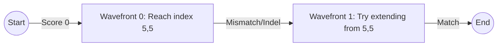

# Wavefront Alignment (WFA) Algorithm

## The Core Concept

Standard Dynamic Programming (Needleman-Wunsch / Smith-Waterman) fills a rectangular grid cell-by-cell. Even if the sequences are identical, it computes $O(N^2)$ cells.

**Wavefront Alignment** (WFA) realizes that optimal alignments usually stay close to the main diagonal. Instead of iterating through coordinates $(i, j)$, it iterates through **scores** $s$.

It asks: **"What is the furthest I can reach in the grid with a penalty score of exactly $s$?"**

### The Visual Difference

For matching `GATTACA` vs `GATTACA`:

#### 1. Standard DP (Grid Filling)

It fills every single cell, regardless of how good the match is.

*Operations:* $7 \times 7 = 49$ calculations.

#### 2. Wavefront Alignment (Diagonal Extension)

It essentially "skips" matching regions.

1. **Wavefront 0 ($s=0$)**: extend perfectly along the diagonal as far as possible (matches).
    * `GATTA` matches `GATTA`. Stopped at `C` vs `G` (mismatch).
2. **Wavefront 1 ($s=1$)**: Try one insertion, one deletion, or one mismatch from where $s=0$ stopped, then extend diagonally again.

*Operations:* Proportional to the number of errors ($E$) times sequence length.

## Detailed Mechanics

WFA maintains "Wavefronts". A wavefront $W_s$ is an array where index $k$ (the diagonal offset) stores the **maximum row index** reachable on diagonal $k$ with score $s$.

1. **Extend**: For the current wavefront, increase the row index as long as characters match (`seq1[i] == seq2[j]`). This is extremely fast (just a while loop comparison).
2. **Transition**: To generate wavefront $s+1$ from $s$:
    * **Mismatch**: Go from $W_s[k] + 1$
    * **Bq (Gap in target)**: Go from $W_s[k-1] + 1$
    * **Bt (Gap in query)**: Go from $W_s[k+1]$

## Speedup Analysis for RiSearch

### Theoretical Complexity

* **Standard DP**: $O(N \cdot M)$
* **WFA**: $O(N \cdot E)$, where $E$ is the "error score" (edit distance).

### The "Curve"

* If sequences are **highly similar** (low $E$), WFA is effectively $O(N)$.
* If sequences are **highly dissimilar** (high $E$), WFA degrades to $O(N^2)$ and can be slower than standard DP due to data structure overhead.

### Specifics for RiSearch (Short Extensions)

Your codebase uses `MAX_DP_EXT = 30`.

1. **Standard DP (Current)**:
    * Operations: $30 \times 30 = 900$ cells.
    * Cost: 900 simple integer updates.

2. **WFA (Proposed)**:
    * Scenario A (Perfect match):
        * 1 wavefront update.
        * Cost: ~30 comparisons + 1 wavefront step. **Speedup: ~20x**.
    * Scenario B (Bad match, score=10):
        * 10 wavefront updates.
        * Management overhead of maintaining `Vec<int>` for diagonals.
        * Cost: Might approach 300-400 ops. **Speedup: ~2-3x**.

### Crucial Caveat: Overhead

For $N=30$, the CPU pipeline overhead of managing variable-sized wavefront arrays might outweigh the benefits of skipping cells.

> [!IMPORTANT]
> **WFA is usually recommended for $N > 100$ or $N > 1000$.**
> For $N=30$, **Bit-Parallel DP** (getting 64 cells done in 1 CPU cycle) is usually superior.

## Comparison Table

| Algorithm | Complexity | Best For | Implementation |
| :--- | :--- | :--- | :--- |
| **Standard DP** | $O(N^2)$ | General purpose, small $N$ | Simple loops |
| **Wavefront (WFA)** | $O(N \cdot E)$ | Long sequences, high similarity | Complex arrays |
| **Bit-Parallel** | $O(N^2 / 64)$ | Short sequences ($N < 64$) | Bitwise ops (XOR/AND) |

## Recommendation

For `risearch` with `MAX_DP_EXT=30`:
**Implement Bit-Parallel DP (Myers' Algorithm)** instead of WFA.
It allows you to compute the entire $30 \times 30$ matrix in roughly $30$ operations (since the width 30 fits in a single 64-bit integer), yielding a consistent **30x speedup** regardless of match quality.
